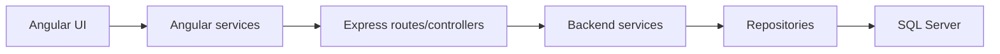

# Arquitectura

## Vision General

Ageru esta separado en frontend Angular y backend Express. La comunicacion entre ambos ocurre por HTTP usando JSON.

## Relacion con MVC

El proyecto aplica una variante practica de MVC distribuido:

- Modelo: `Backend/src/repositories`, `Backend/src/services` y SQL Server.
- Vista: templates y estilos en `Frontend/src/app/pages`.
- Controlador: `Backend/src/controllers` y rutas en `Backend/src/routes`.

Angular tambien usa componentes como capa de presentacion y coordinacion de estado de UI.

## Frontend

Carpetas principales:

- `core/services`: clientes HTTP y servicios compartidos.
- `pages/index-page`: layout autenticado, header, notificaciones y dashboard.
- `pages/transaction-page`: transferencias, modal de contactos e historial.
- `pages/contacts-page`: gestion de contactos frecuentes.
- `pages/profile-page`: datos de usuario y verificacion SMS.
- `pages/placeholder-page`: pantallas de operaciones planificadas o administrativas.

Estado de sesion:

- `SessionService` centraliza usuario, cuenta y avatar.
- La sesion se guarda en `sessionStorage` para permitir varias cuentas en distintas pestanas durante la demo.
- `NotificationCenterService` usa `BroadcastChannel` para avisar transferencias entre pestanas del mismo navegador.

## Backend

Capas principales:

- `routes`: define endpoints HTTP.
- `controllers`: valida payloads basicos y arma respuestas.
- `services`: contiene reglas de negocio.
- `repositories`: ejecuta consultas SQL parametrizadas.
- `utils`: errores, respuestas y utilidades.
- `middlewares`: manejo global de errores.

Flujo de transferencia:

1. El frontend envia `usuarioId`, `cuentaOrigenId`, destino, monto y descripcion.
2. El controlador valida campos obligatorios.
3. El servicio valida usuario, cuenta origen, cuenta destino, saldo y estado.
4. El repositorio ejecuta una transaccion SQL atomica.
5. El backend devuelve transaccion, cuenta origen y cuenta destino actualizadas.
6. El frontend actualiza sesion, movimientos, dashboard y notificaciones.

## Reglas de Diseno Aplicadas

- Mantener logica de negocio en backend.
- Evitar que una cuenta vea movimientos de otras cuentas.
- Usar consultas parametrizadas.
- Preferir servicios pequenos y responsabilidades claras.
- Evitar polling para transferencias entre pestanas; usar evento local con `BroadcastChannel`.
- Mantener la UI reactiva con signals de Angular.
